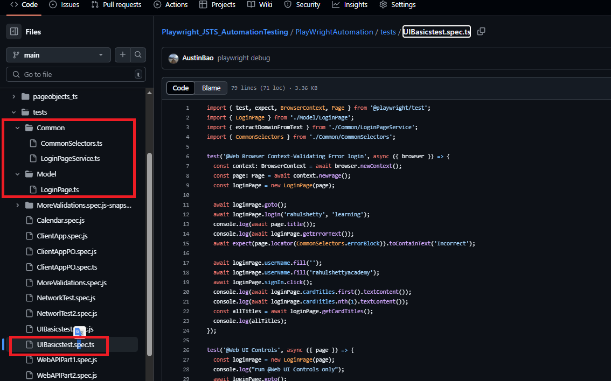
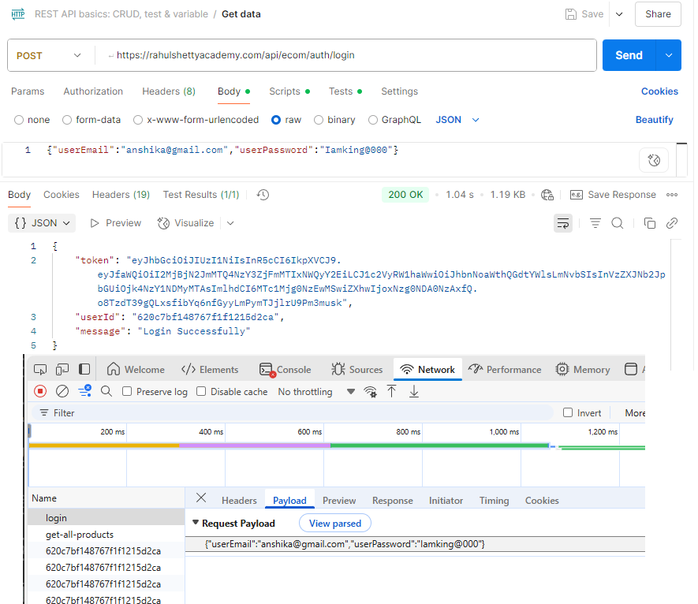
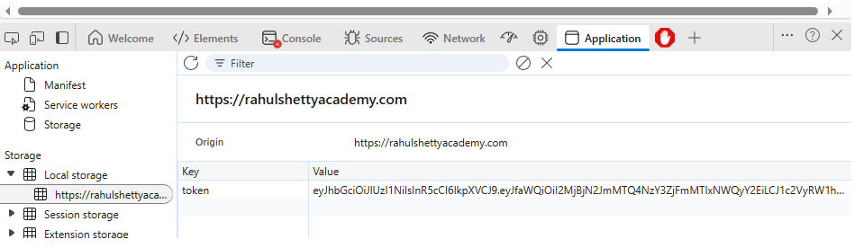
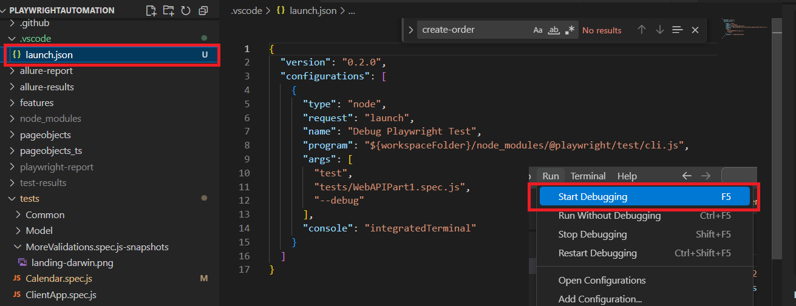
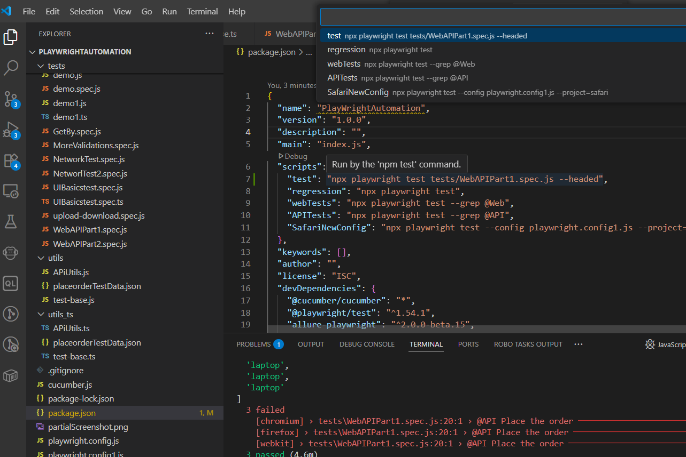

# Playwright_JSTS_AutomationTesting

## install nodejs, run node xx.js on vs code terminal

## prepare playwright project
create folder (the code and test will go there)
cd to that folder, run playwright locally 
```npm install -D @playwright/test```

## playwright modules
```
"exports": {
    ".": {
      "types": "./index.d.ts",
      "import": "./index.mjs",
      "require": "./index.js",
      "default": "./index.js"
    },
    "./cli": "./cli.js",
    "./package.json": "./package.json",
    "./reporter": "./reporter.js"
  },
```
This is what makes playwright/test a virtual alias to @playwright/test/index.mjs.
| Key       | Who uses it?                      | Why it's needed                | Real-world effect                                                  |
| --------- | --------------------------------- | ------------------------------ | ------------------------------------------------------------------ |
| `types`   | TypeScript compiler               | Provides types (`.d.ts`)       | Enables IntelliSense and type checking in editors and TS builds    |
| `import`  | ESM-compatible Node.js & bundlers | Loads ES modules (`.mjs`)      | Used when you write `import { test } from '@playwright/test'`      |
| `require` | CommonJS environments             | Loads CommonJS modules (`.js`) | Used when you write `const { test } = require('@playwright/test')` |
| `default` | Bundlers or dual-mode modules     | Fallback/default resolution    | Helps tools or frameworks handle default imports gracefully        |

| Code                                      | Meaning                                             |
| ----------------------------------------- | --------------------------------------------------- |
| `import { test } from '@playwright/test'` | Import only the named export `test` from the module |
| `import * as pt from '@playwright/test'`  | Import all exports into an object `pt`              |
| `import defaultExport from ...`           | Import the default export, if defined               |
Second one means you could code like this 
```
pt.test(...)
pt.expect(...)
```

## how {test} works
The playwright/test path works because @playwright/test uses the exports field in its package.json to route imports to a wrapper file (test.js/test.mjs) that re-exports all key testing APIs like test and expect.
```
"./test": {
      "types": "./test.d.ts",
      "import": "./test.mjs",
      "require": "./test.js",
      "default": "./test.js"
    }
	
import playwright from './test.js';
...
export const test = playwright.test;
export const expect = playwright.expect;
...
```

## run single test file
```
npx playwright test tests/UIBasicstest.spec.js
```

## debug one test case only
```
test.only('@Web UI Controls', async ({ page }) => {
npx playwright test --debug
```
## increase timeout and expect timeout for debug only
```
export default defineConfig({
  testDir: './tests',
  timeout: process.env.PWDEBUG ? 120 * 1000 : 40 * 1000, // 2 min for debug, 40s otherwise
  expect: { timeout: process.env.PWDEBUG ? 20000 : 5000 }, // 20s for debug, 5s otherwise
```

## generate test step at beginning
```npx playwright codegen https://google.com ```

## make test less depency on data (first card item)
https://github.com/bobydo/Playwright_JSTS_AutomationTesting/blob/main/PlayWrightAutomation/tests/ClientApp.spec.js

## typescript version to make code clean and reusable


## The primary benefit of using await page.pressSequentially("ind"); over await page.fill("input", "ind"); 
is that it simulates real user typing, sending each key event one by one. This can trigger JavaScript events (like onKeyPress, onInput, onChange) 
and autocomplete behaviors that may not be triggered by fill, which sets the value directly.

## You should consider using await page.pause() in your Playwright test script 
when you want to debug your test interactively. It pauses the test execution and opens the Playwright Inspector, 
allowing you to:
Step through your test code line by line
Inspect the page state and elements
Try locators and actions manually

## API call and token



## Login once and save all state to json file and use webContext to skip login
```
test.beforeAll(async ({ browser }) => {
    const context = await browser.newContext();
    const page = await context.newPage();
    await page.goto("https://rahulshettyacademy.com/client");
    await page.locator("#userEmail").fill("rahulshetty@gmail.com");
    await page.locator("#userPassword").fill("Iamking@000");
    await page.locator("[value='Login']").click();
    await page.waitForLoadState('networkidle');
    //Saves the browser context’s storage state (cookies, localStorage, etc.) to a file called state.json.
    await context.storageState({ path: 'state.json' });
    //All tests can use webContext to start with a logged-in session, 
    //skipping the UI login step and speeding up test execution.
    webContext = await browser.newContext({ storageState: 'state.json' });
})
```

## Use VS code Debug (not npx command line)

OR


## npx CLI arguments
```
Here’s a table of common Playwright CLI options for npx playwright test and what they do:
Option				Description
--headed			Runs browsers in headed mode (shows browser window).
--debug				Opens Playwright Inspector for interactive debugging.
--project=<name>	Runs tests only for the specified project (browser) from your config.
--grep <pattern>	Runs only tests matching the pattern (by title).
`--trace on	off
--workers <number>	Sets the number of parallel workers (threads) for running tests.
--timeout <ms>		Overrides the default test timeout (in milliseconds).
--reporter <type>	Specifies the reporter type (e.g., html, list, json).
--output <dir>		Sets the output directory for test artifacts (screenshots, videos, traces).
--update-snapshots	Updates all visual and text snapshots.
--list				Lists all discovered tests without running them.
--max-failures <n>	Stops the test run after n failures.
--ui				Opens the Playwright Test UI for running and managing tests interactively.
Example usage:
npx playwright test --headed --debug --project=chromium --grep "login"
```