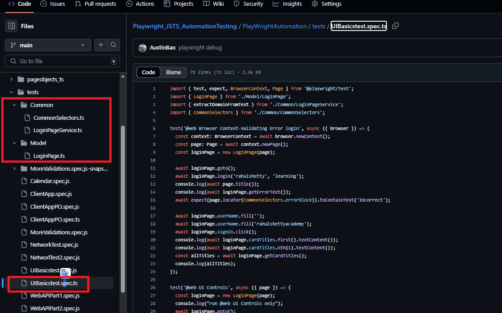
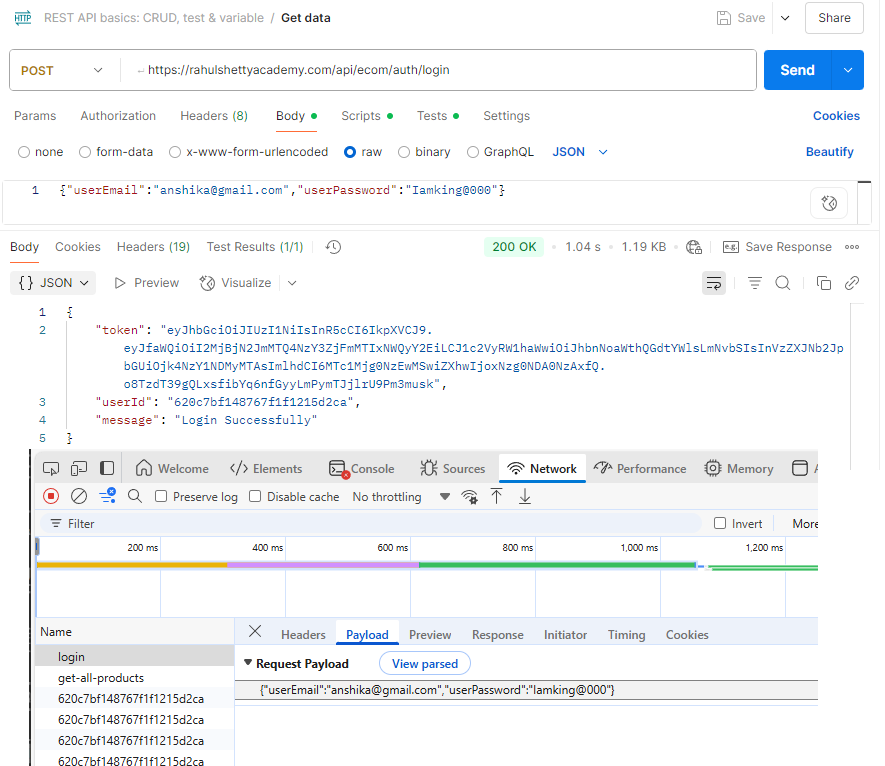
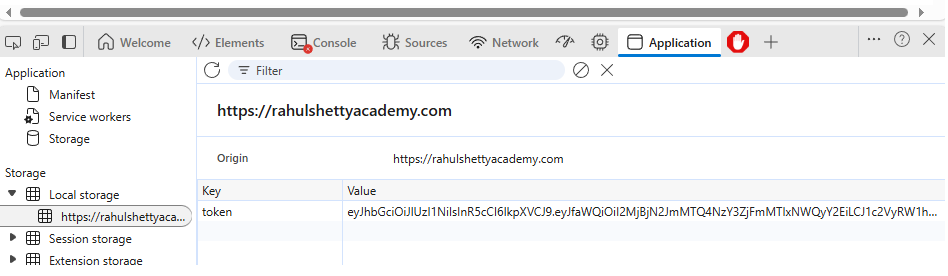
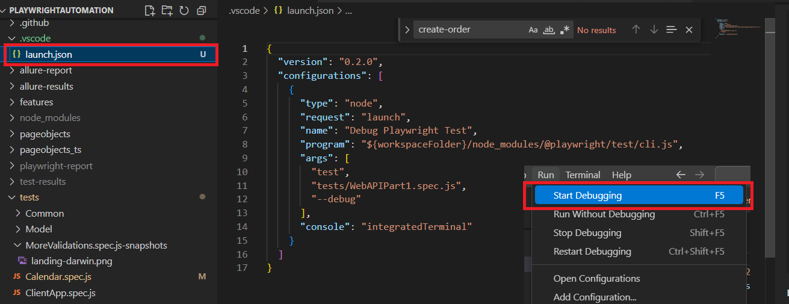
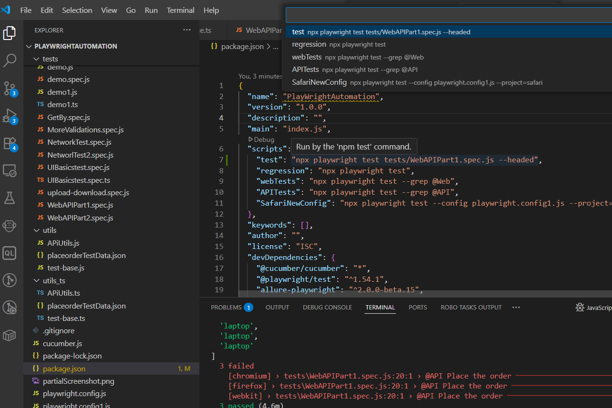
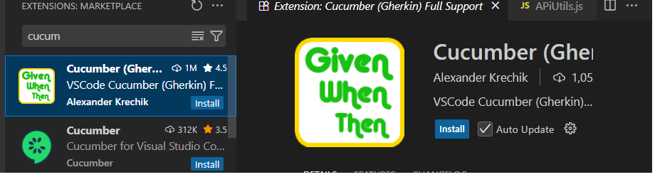
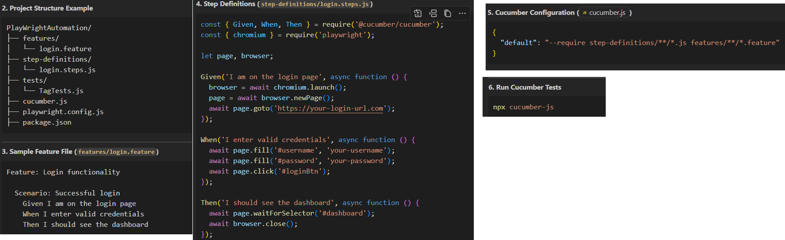
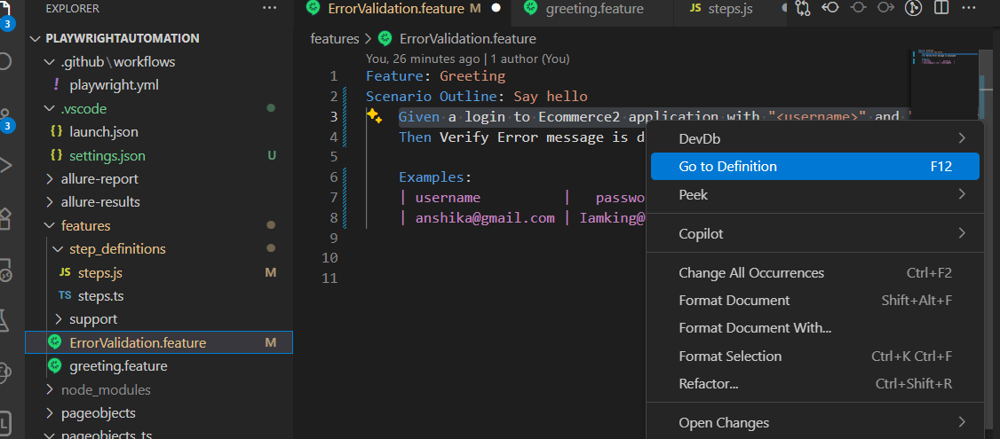
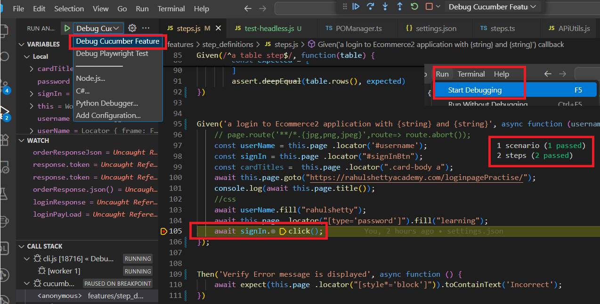

# Playwright_JSTS_AutomationTesting

## install nodejs, run node xx.js on vs code terminal

## prepare playwright project
create folder (the code and test will go there)
cd to that folder, run playwright locally 
```npm install -D @playwright/test```

## playwright modules
```
"exports": {
    ".": {
      "types": "./index.d.ts",
      "import": "./index.mjs",
      "require": "./index.js",
      "default": "./index.js"
    },
    "./cli": "./cli.js",
    "./package.json": "./package.json",
    "./reporter": "./reporter.js"
  },
```
This is what makes playwright/test a virtual alias to @playwright/test/index.mjs.
| Key       | Who uses it?                      | Why it's needed                | Real-world effect                                                  |
| --------- | --------------------------------- | ------------------------------ | ------------------------------------------------------------------ |
| `types`   | TypeScript compiler               | Provides types (`.d.ts`)       | Enables IntelliSense and type checking in editors and TS builds    |
| `import`  | ESM-compatible Node.js & bundlers | Loads ES modules (`.mjs`)      | Used when you write `import { test } from '@playwright/test'`      |
| `require` | CommonJS environments             | Loads CommonJS modules (`.js`) | Used when you write `const { test } = require('@playwright/test')` |
| `default` | Bundlers or dual-mode modules     | Fallback/default resolution    | Helps tools or frameworks handle default imports gracefully        |

| Code                                      | Meaning                                             |
| ----------------------------------------- | --------------------------------------------------- |
| `import { test } from '@playwright/test'` | Import only the named export `test` from the module |
| `import * as pt from '@playwright/test'`  | Import all exports into an object `pt`              |
| `import defaultExport from ...`           | Import the default export, if defined               |
Second one means you could code like this 
```
pt.test(...)
pt.expect(...)
```

## how {test} works
The playwright/test path works because @playwright/test uses the exports field in its package.json to route imports to a wrapper file (test.js/test.mjs) that re-exports all key testing APIs like test and expect.
```
"./test": {
      "types": "./test.d.ts",
      "import": "./test.mjs",
      "require": "./test.js",
      "default": "./test.js"
    }
	
import playwright from './test.js';
...
export const test = playwright.test;
export const expect = playwright.expect;
...
```

## run single test file
```
npx playwright test tests/UIBasicstest.spec.js
```

## debug one test case only
```
test.only('@Web UI Controls', async ({ page }) => {
npx playwright test --debug
```
## increase timeout and expect timeout for debug only
```
export default defineConfig({
  testDir: './tests',
  timeout: process.env.PWDEBUG ? 120 * 1000 : 40 * 1000, // 2 min for debug, 40s otherwise
  expect: { timeout: process.env.PWDEBUG ? 20000 : 5000 }, // 20s for debug, 5s otherwise
```

## generate test step at beginning
```npx playwright codegen https://google.com ```

## make test less depency on data (first card item)
https://github.com/bobydo/Playwright_JSTS_AutomationTesting/blob/main/PlayWrightAutomation/tests/ClientApp.spec.js

## typescript version to make code clean and reusable


## The primary benefit of using await page.pressSequentially("ind"); over await page.fill("input", "ind"); 
is that it simulates real user typing, sending each key event one by one. This can trigger JavaScript events (like onKeyPress, onInput, onChange) 
and autocomplete behaviors that may not be triggered by fill, which sets the value directly.

## You should consider using await page.pause() in your Playwright test script 
when you want to debug your test interactively. It pauses the test execution and opens the Playwright Inspector, 
allowing you to:
Step through your test code line by line
Inspect the page state and elements
Try locators and actions manually

## API call and token



## Login once and save all state to json file and use webContext to skip login
```
test.beforeAll(async ({ browser }) => {
    const context = await browser.newContext();
    const page = await context.newPage();
    await page.goto("https://rahulshettyacademy.com/client");
    await page.locator("#userEmail").fill("rahulshetty@gmail.com");
    await page.locator("#userPassword").fill("Iamking@000");
    await page.locator("[value='Login']").click();
    await page.waitForLoadState('networkidle');
    //Saves the browser context’s storage state (cookies, localStorage, etc.) to a file called state.json.
    await context.storageState({ path: 'state.json' });
    //All tests can use webContext to start with a logged-in session, 
    //skipping the UI login step and speeding up test execution.
    webContext = await browser.newContext({ storageState: 'state.json' });
})
```

## Use VS code Debug (not npx command line)

OR ctrl+shift+P or select debug from package.json


## npx CLI arguments
```
Here’s a table of common Playwright CLI options for npx playwright test and what they do:
Option				Description
--headed			Runs browsers in headed mode (shows browser window).
--debug				Opens Playwright Inspector for interactive debugging.
--project=<name>	Runs tests only for the specified project (browser) from your config.
--grep <pattern>	Runs only tests matching the pattern (by title).
`--trace on	off
--workers <number>	Sets the number of parallel workers (threads) for running tests.
--timeout <ms>		Overrides the default test timeout (in milliseconds).
--reporter <type>	Specifies the reporter type (e.g., html, list, json).
--output <dir>		Sets the output directory for test artifacts (screenshots, videos, traces).
--update-snapshots	Updates all visual and text snapshots.
--list				Lists all discovered tests without running them.
--max-failures <n>	Stops the test run after n failures.
--ui				Opens the Playwright Test UI for running and managing tests interactively.
Example usage:
npx playwright test --headed --debug --project=chromium --grep "login"
```
## page.route to intercept, modify, block, or mock network requests.
```
Common use cases:
Use Case						Example Scenario
Mock API responses				Return fake data for API endpoints to test UI behavior.
Block requests					Prevent loading of ads, images, or third-party resources.
Modify requests/responses		Change request headers, payloads, or response bodies.
Simulate errors/timeouts		Test how your app handles failed or slow network calls.
Test edge cases					Provide specific data or errors that are hard to reproduce.
For example, const fakePayLoadOrders = { data: [], message: "No Orders" };
```

## take screenshot and comparie it with previous
```
await page.screenshot({path: 'screenshot.png'});
expect(await page.screenshot()).toMatchSnapshot('landing.png');
```
## Features
```
placeorderTestData.json shows load data from json file
test-base.js extend test of playwright
FileHelper for find folder and file, for file download and upload used in ScreenshotValidations.spec.js
```

## test responsive on cell phone and recording on failure
npx playwright test tests/testcase.js --config=playwright.config.cellphone.js --headed

## Race conditions in Playwright tests often happen when tests run in parallel and share state 
(e.g., same user, database, or files), causing unpredictable failures.

How to Fix Race Conditions
Run dependent tests in serial:
Use test.describe.configure({ mode: 'serial' }) so tests run one after another.

Isolate test data:
Use unique data for each test (e.g., different users, temp files).

Avoid shared resources:
Don’t let tests modify the same resource at the same time.

## Run Only Tagged Tests (TagTests.js)
### Run only smoke tests:
npx playwright test --grep @smoke
### Run only regression tests:
npx playwright test --grep @regression
### Exclude a tag (run all except smoke):
npx playwright test --grep-invert @smoke

## Allure Reporting (Update your playwright.config.js)
```
npm install allure-playwright --save-dev
reporter: [
  ['html', { open: 'never' }],
  ['allure-playwright']
],
```

## Create custom scripts to trigger the tests from package.json file
```
{
  "scripts": {
    "test:smoke": "npx playwright test --grep @smoke",
    "test:regression": "npx playwright test --grep @regression",
    "test:all": "npx playwright test",
    "test:html": "npx playwright test --reporter=html"
  }
}
npm run test:smoke
npm run test:regression
npm run test:all
npm run test:html
```

## Intergrate with Jenkin
Jenkins passes the TEST_TAG parameter to the Playwright CLI.
You can trigger the job with any tag (e.g., @smoke, @regression).
The HTML report is published after the test run.
```
pipeline {
    agent any
    parameters {
        string(name: 'TEST_TAG', defaultValue: '@smoke', description: 'Tag to run Playwright tests')
    }
    stages {
        stage('Install Dependencies') {
            steps {
                sh 'npm ci'
            }
        }
        stage('Run Playwright Tests') {
            steps {
                sh "npx playwright test --grep ${params.TEST_TAG} --reporter=html"
            }
        }
        stage('Publish HTML Report') {
            steps {
                publishHTML(target: [
                    reportName: 'Playwright HTML Report',
                    reportDir: 'playwright-report',
                    reportFiles: 'index.html',
                    alwaysLinkToLastBuild: true
                ])
            }
        }
    }
}
```

## To use Cucumber with Playwright, you need 
- npm install @cucumber/cucumber @playwright/test
- install cucumber extension


Set up Cucumber configuration and organize your feature files
- Place feature files in the features folder.
- Place step definitions in step-definitions/.
- Configure Cucumber in cucumber.js (important it has its own config)
- Use Playwright in your step definitions for browser automation.
- Run tests with npx cucumber-js.


## After create setting.json, right click feature steps
```
{
  "cucumberautocomplete.steps": [
    "features/step_definitions/*.js",
    "features/step_definitions/*.ts"
  ],
  "cucumberautocomplete.syncfeatures": "features/*.feature"
}
```


## Cucumber debug
```
    {
      "type": "node",
      "request": "launch",
      "name": "Debug Cucumber Feature",
      "program": "${workspaceFolder}/node_modules/@cucumber/cucumber/bin/cucumber-js",
      "args": [
        "features/ErrorValidation.feature"
      ],
      "console": "integratedTerminal"
    }
```
Ctrl + Shift + D to choose which debugger



